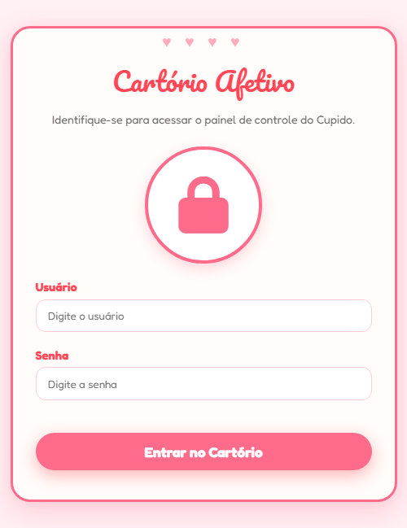
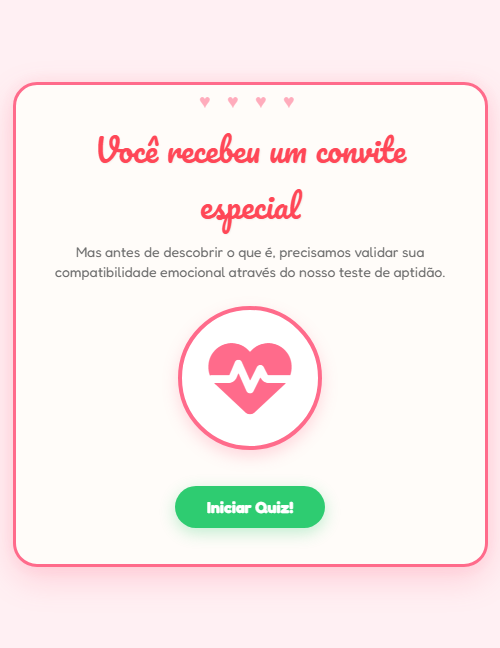
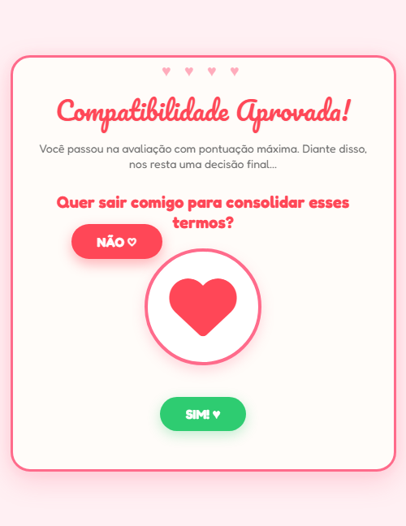
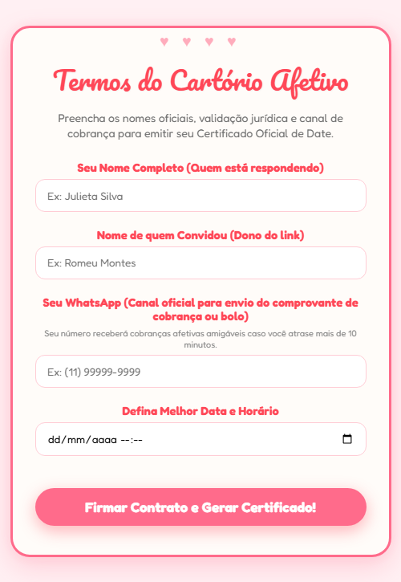
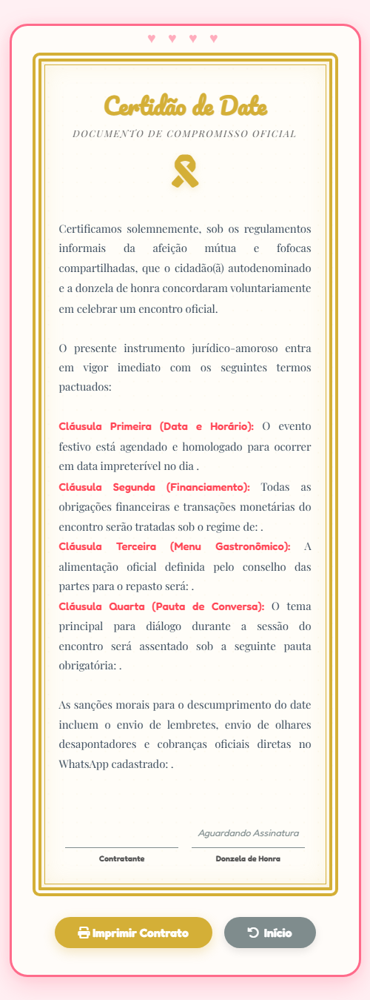
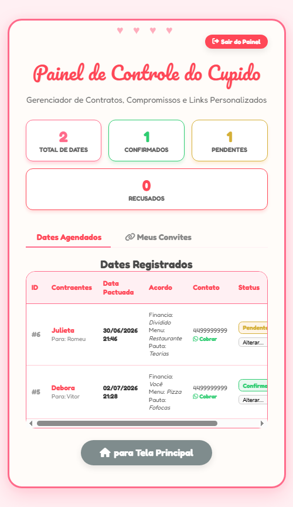

# 💘 Cartório Afetivo - Date Agendor

Um aplicativo web divertido, interativo e altamente romântico (com aquela estética clássica brega) para propor encontros/dates e validar a compatibilidade emocional do pretendente!

---

## 🚀 Funcionalidades

- **Quiz de Compatibilidade**: Perguntas interativas com transições suaves que testam afinidades culinárias, divisão de custos e assuntos prioritários.
- **Botão Evasivo**: Um botão "NÃO" no passo decisivo que foge do cursor do mouse, tornando a rejeição tecnicamente impossível. 😉
- **Painel Administrativo (`/painel`)**: Controle total sobre as propostas recebidas, contendo estatísticas (pendentes/confirmados/recusados) e links gerados.
- **Gerador de Convites Personalizados**: O pretendente pode configurar um título único, subtítulo e opções de respostas personalizadas direto do painel administrativo.
- **Certificado Afetivo Reluzente**: Quando o quiz é respondido com sucesso, um contrato/certificado de date permanente é emitido.
- **Autenticação Segura**: Rota `/painel` protegida com controle de sessão.
  - **Usuário padrão**: `admin`
  - **Senha padrão**: `admin`

---

## 🛠️ Tecnologias Utilizadas

- **Backend**: Python 3 com microframework [Flask](https://flask.palletsprojects.com/)
- **Banco de Dados**: SQLite3 para persistência local rápida e sem configurações complexas
- **Frontend**: HTML5, CSS3 Grid, JavaScript Puro (Efeitos de partículas de corações flutuantes e algoritmo do botão evasivo)

---

## 📦 Como Executar o Projeto

1. Certifique-se de ter o Python instalado em sua máquina.
2. Instale as dependências necessárias:
   ```bash
   pip install -r requirements.txt
   ```
3. Inicie o servidor da aplicação:
   ```bash
   python app.py
   ```
4. Acesse em seu navegador:
   - **Quiz / Página Principal**: `http://127.0.0.1:5000`
   - **Painel Cupido**: `http://127.0.0.1:5000/painel`

---

## 📸 Galeria do Amor (Demonstração Visual)

Aqui está o passo a passo de como o Cartório Afetivo conduz seus pretendentes:

### 1. Portal de Acesso do Cupido (Login)
*Onde apenas corações autorizados entram com as credenciais padrão.*


### 2. O Teste de Aptidão Emocional (Quiz)
*Validando se as almas realmente combinam com as perguntas configuradas.*


### 3. A Decisão Inevitável (Evasão do Não)
*O clássico momento onde dizer "Não" deixa de ser uma opção fisicamente realizável.*


### 4. Selamento Contratual (Dados Finais)
*Coleta de nomes oficiais, WhatsApp e data desejada.*


### 5. O Selo de Autenticidade (Certificado)
*O documento oficial gerado para provar cientificamente a compatibilidade do date.*


### 6. Central do Cupido (Painel)
*O cérebro da operação. Onde acompanhamos os dates aceitos, configuramos novos testes e monitoramos as estatísticas.*

